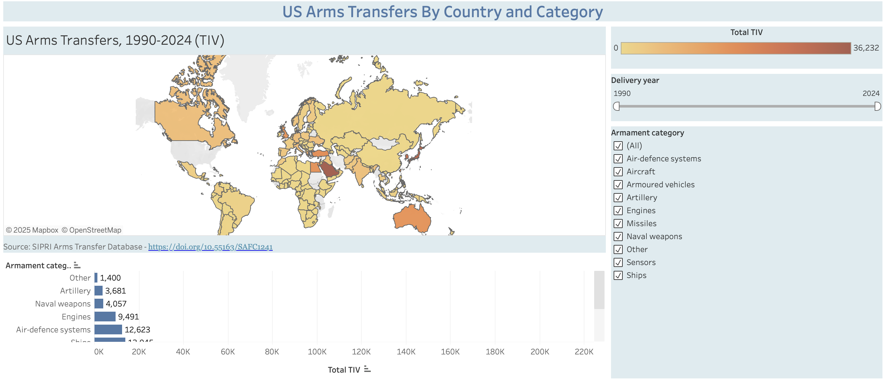

# Visualizing US Arms Transfers
Jack Higgins

## Purpose:
The purpose 

## Data Used
The primary data source for this repository is the Stockholm International Peace Research Institute's (SIRPI) Arms Transfer Database. SIPRI's Arms Transfer Database tracks all major arms transfers. Specifically, this repository uses data from SIPRI's Transfer Register.

## Script Descriptions

## Key Visualizations and Findings

## Tableau Landing Page
Thee Tableau page which visualizes the data can be accessed here:
 https://public.tableau.com/views/ArmsTIVMap/Visualization?:language=en-US&publish=yes&:sid=&:redirect=auth&:display_count=n&:origin=viz_share_link

The landing page includes two main features, a heat map of the world which represents the amount of arms (TIV) a country has recieved from the US in a given time period, and a bar graph representing the total amount of arms (TIV) that the US has trasnferred by armament category. The map can be filtered by armament category, and both the map and the bar graph may be filtered by year, to indicate the amount transferred during a specific time frame.

 The page appears like this:
 