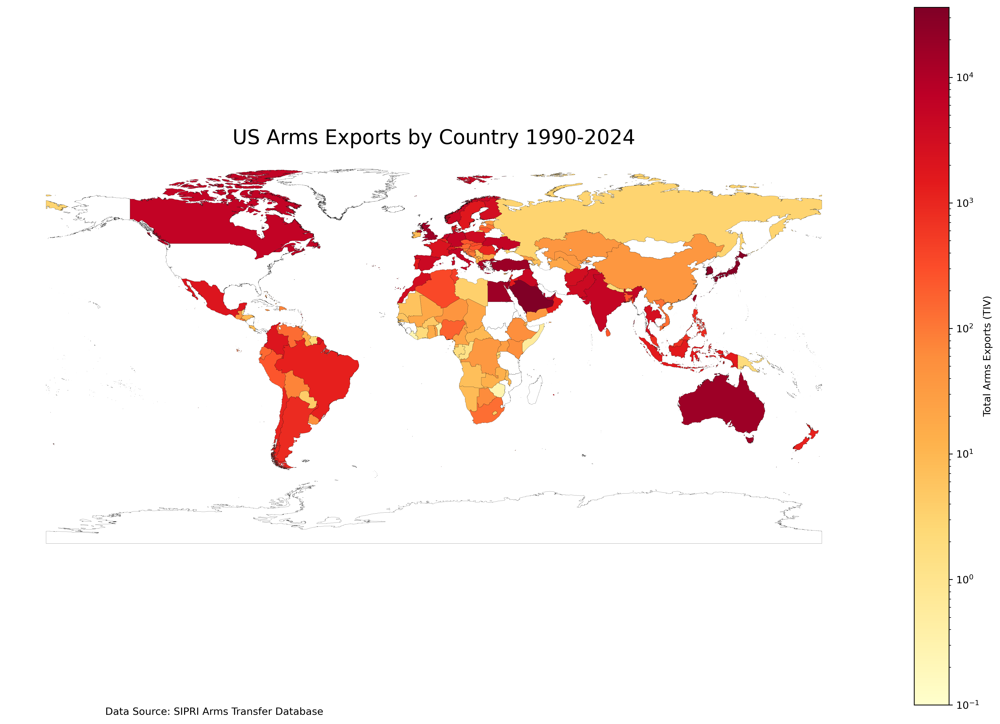
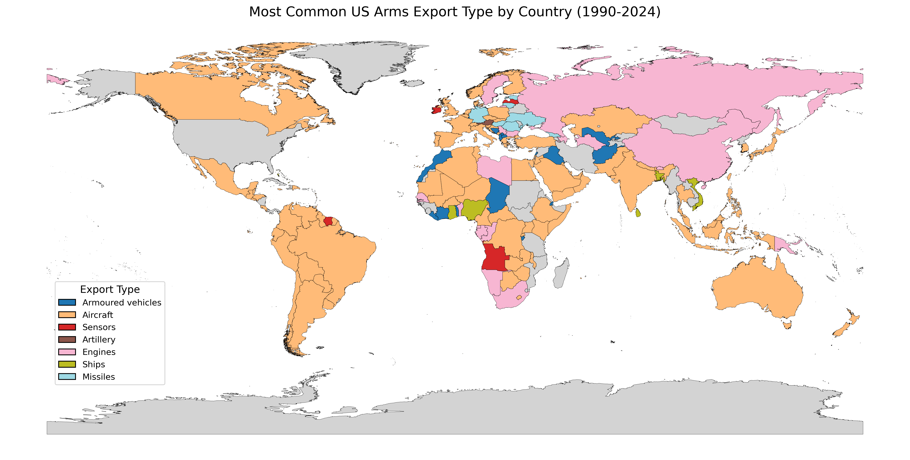
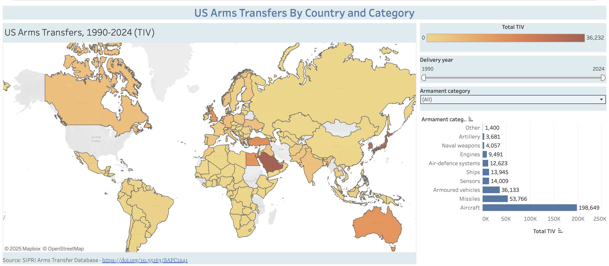

# Visualizing US Arms Transfers
by Jack Higgins

## Purpose:
This repository intakes complex SIPRI arms transfer data, transforming it into accessible visual representations that illuminate U.S. weapons export patterns globally. The U.S. is the world's leading exporter of weapons. Weapons transfers play an important role in U.S. foreign policy. They can be tools to promote international and regional security, or they can contribute to conflict. SIPRI provides extremely comprehensive data tracking the global movement of arms, but it can be difficult to sift through and understand. The goal of this project is to make U.S. arms transfers accessible and easy to analyze. Through dynamic heat maps depicting geographic distribution, categorical maps identifying prevalent armament types exported, and an interactive Tableau visualization allowing temporal analysis, the project renders otherwise dense datasets comprehensible. This visual approach to arms transfer data analysis offers context  to help understand U.S. arms transfer policy, and may be used to inform deeper analysis or simply to satisfy your curiosity about where the U.S. sends weapons.

## Input Data

### Arms Transfer Data
The primary data source for this repository is the Stockholm International Peace Research Institute's (SIRPI) Arms Transfer Database. SIPRI measures arms transfers using Trend Indicator Value (TIV), a unit intended to standardize weapon value for comparison. The TIV is based on the known unit production costs of a core set of weapons and is intended to represent the transfer of military resources rather than the financial value of the transfer. More information on SIPRI's methods can be found [here](https://www.sipri.org/databases/armstransfers/sources-and-methods).

Specifically, this repository uses data from SIPRI's transfer register, a register of all transfers of major arms between selected recipients and/or suppliers. The data includes the suppliers and recipients, the designation, description and number of weapons ordered and delivered, the years of deliveries, comments on other aspects of the transfers, and the SIPRI TIV for each transfer. This repository includes the data "trade-register.csv" which is the result of querying SIPRI's Transfer register for all available transfers supplied by the US. While this repository is intended to analyze US transfers, alternate supplier/recipient datasets can be retrieved from SIPRI, and graphed using the functions included in the following scripts. The data can be found [here](https://armstransfers.sipri.org/ArmsTransfer/), under Data -> Transfer Register.

### Geographic Data
This repository also uses a shape file of the world, retrieved from natural earth, "ne_10m_admin_0_countries.zip". This file is not included in the repository, and **must be downloaded** and saved to your local repository to run the scripts. The specific shapefile can be found [here](https://www.naturalearthdata.com/downloads/10m-cultural-vectors/10m-admin-0-countries/), via the "Download Countries" link.

## Outputs
### Scripts
The following scripts are included in this repository. The script "read.py" must be run first, but the order of the other scripts is not important. It is also important to download the zipped shapefile from natural earth before running the scripts.
1. [read.py](read.py): This script reads "trade-register.csv" into a dataframe, skipping over unnecessary SIPRI headings that interfere with the data. The script also cleans the data, limiting it to transfers from 1990-2024, removing a few non-country recipients of US arms, removing columns that will not be used, and re-naming several countries to match the natural earth shapefile. The script then saves the clean data for later use.

2. [heatmap.py](heatmap.py): This script uses a function to create world heatmaps from the cleaned data. The function aggregates the data by country and year, logging the total TIV countries recieve over a period of time to adjust for outliers and make the data easy to visually digest. The function takes parameters for a start year and end year, to produce maps for desired periods of time. It currently creates maps for every decade from 1990-2020, and for 2020-2024, but this can be easily adjusted to produce maps for desired timeperiods.

3. [typeamtmap.py](typeamtmap.py): This script uses a function to create world maps which color countries based on the weapon type they recieve the most of in TIV from the US during a given period of time. It takes arguments for start and end years, and can easily be called to map desired time periods. The script currently creates maps for 1990-2024, 2022-2024 to represent Russia's invasion of Ukraine, and 2003-2011 to represent the war in Iraq.

4. [tableau.py](tableau.py): This script aggregates the cleaned data by country, year, and armament type. It then saves this data as "arms_transfers_aggregated.csv". this csv is what I used to create the Tableau visualizaiton linked below.

### Other Output Files
1. "trimmed_trade.csv" is the cleaned data produced by [read.py](read.py), and it is used in the next three scripts.

2. "arms_transfers_aggregated.csv" is the aggregated csv produced by [tableau.py](tableau.py) which is used to create the tableau visualization.
## Visualizations
### Heat Map Representing Total TIV by Country

This is one of the heat maps generated by the script [heatmap.py](heatmap.py). It uses represents U.S. arms exports to every country in SIPRI TIV values from 1990-2024. The TIV values have been logged to condense the data and make the heat map easier to read. The script also produces heatmaps for every decade from 1990-2024, and can be queried for desired time periods.

### Map Representing Most Common Armament Type

This map represents the highest TIV of armament category that the U.S. exported to every country from the years 1990-2024. Each color represents a different type of weapon. The script [typeamtmap.py](typeamtmap.py) generated this map, and may be queried to generate similar maps represeting a desired time period.
## Tableau Landing Page
The Tableau page which visualizes the data can be accessed [here](https://public.tableau.com/views/ArmsTIVMap/Visualization?:language=en-US&publish=yes&:sid=&:redirect=auth&:display_count=n&:origin=viz_share_link)

The landing page includes two main features, a heat map of the world which represents the amount of arms (TIV) a country has recieved from the US in a given time period, and a bar graph representing the total amount of arms (TIV) that the US has trasnferred by armament category. The map can be filtered by armament category, and both the map and the bar graph may be filtered by year, to indicate the amount transferred during a specific time frame.

 The page appears like this:
 

 ## Discussion
 The results of this repository indicate trends in U.S. arms transfers across regions and time. For example, you can see the U.S. stop transferring arms to China in the early 2000's, or increase its transfers in the Middle East after 2001. The project is especially useful to track these kind of trends, referencing them against real world events. Ultimately, the goal is to provide a few flexible and easily digestible visualizations.